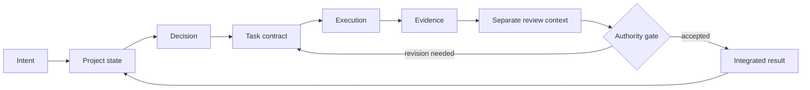

# AI-First Project Lifecycle

A working project workflow with four independent levels—from one focused AI session to governed autonomy.

Use only the level your work needs. Each level defines its memory, roles, authority boundaries, evidence requirements, and completion loop. The repository also documents the visual pipelines and real failure modes that shaped the system.

This is not a claim that every pattern here is new, or that this is the correct workflow for every project. It is the current form of a system built while running a real long-term project. It grew one failure at a time.

## Choose the lowest sufficient level

| Your work… | Start with |
|---|---|
| fits in one session and is easy to inspect | [Level 1 — Focused Session](levels/1-focused-session.md) |
| must survive a pause, a new chat, or a different model | [Level 2 — Resumable Project](levels/2-resumable-project.md) |
| benefits from separate planning, execution, and review | [Level 3 — Separated Lifecycle](levels/3-separated-lifecycle.md) |
| should run through repeated tasks with bounded human involvement | [Level 4 — Governed Autonomy](levels/4-governed-autonomy.md) |

A large project does not need to use one level for everything. A routine task may use Level 1 while a high-impact workstream in the same project uses Level 4. The one prerequisite is that Level 4 automates the Level 3 loop, so that loop must already work by hand before it is worth automating — see [Choosing a level](docs/choosing-a-level.md).

> Use the lowest level that can reliably handle the work.

Read [Choosing a level](docs/choosing-a-level.md) for the full decision guide.

## The lifecycle



The same loop changes shape across the four levels. Simple work keeps several responsibilities in one session. Complex work separates them into distinct contexts, roles, and gates.

## What this repository helps you do

- keep project state usable across sessions and models;
- prevent stale files from silently becoming current truth;
- separate decision-making, execution, and review when the risk justifies it;
- create domain roles with owned knowledge bases and report contracts;
- replace “the agent says it is done” with inspectable evidence;
- define decisions that an agent may recommend but cannot approve;
- generate, approve, normalize, and track visual assets;
- transfer an approved mock into implementation through layout data, runtime captures, and visual comparison;
- increase autonomy without giving an orchestrator unlimited authority;
- understand which failure caused each layer of process to exist.

## Repository map

```text
levels/       Four complete operating configurations.
components/   Canonical building blocks shared by the levels.
pipelines/    Specialized flows for domain and visual work.
templates/    Copyable project artifacts.
evolution/    The history and failures that shaped the lifecycle.
examples/     A worked example and a small sample workspace.
docs/         Principles, selection guidance, and terminology.
diagrams/     Where to find the diagrams, which live beside the text they explain.
```

The levels are independently understandable, but shared components and templates have one canonical home. This avoids four drifting copies of the same rule.

## Core components

| Component | What it controls |
|---|---|
| [Memory and context](components/memory-and-context.md) | Canonical homes, routing, freshness, and archives |
| [Model and context routing](components/model-and-context-routing.md) | Match capability, effort, and loaded context to each responsibility |
| [Role architecture](components/role-architecture.md) | Mandates, knowledge bases, reports, and role boundaries |
| [Authority and approvals](components/authority-and-approvals.md) | Who may observe, recommend, decide, change, and approve |
| [Evidence and verification](components/evidence-and-verification.md) | Claim-to-evidence mapping, fail-closed checks, and honest accounting |
| [Review and triage](components/review-and-triage.md) | Review lenses, shared findings, and explicit dispositions |
| [Integration and landing](components/integration-and-landing.md) | Work lines, atomic units, revert units, and the landing gate |
| [Workflow evolution](components/workflow-evolution.md) | Process proposals, experiments, and rule retirement |

## Specialized pipelines

| Pipeline | Use it when… |
|---|---|
| [Standard task](pipelines/standard-task.md) | work needs a bounded contract and completion loop |
| [Research](pipelines/research.md) | a question needs sourced external knowledge and a durable report |
| [Domain role](pipelines/domain-role.md) | a recurring knowledge gap needs owned research and reports |
| [Visual assets](pipelines/visual-assets.md) | generated images need curation, approval, normalization, and provenance |
| [Mock to implementation](pipelines/mock-to-implementation.md) | an approved visual target must be transferred and verified precisely |

Browse the [template catalog](templates/README.md) to copy the artifacts required by the selected Level.

## Try it on one task

You do not need to install the whole lifecycle.

1. Pick a small, reversible piece of work.
2. Copy the [Task Brief](templates/task-brief.md).
3. Fill the outcome, boundaries, references, verification, and stop conditions.
4. Give the filled brief and its named inputs to one AI session.
5. Require the session to return the result, actual verification, and remaining uncertainty.
6. Inspect the output yourself.

That is a complete Level 1 use. If another session must resume the work, add the Level 2 current-state layer. Add separation, roles, visual pipelines, or autonomy only when their controls address an observed problem.

## Three ideas behind the system

### Files are memory, but files alone are not enough

The project used files from the beginning. The problem was not moving knowledge out of chat; it was deciding which files were current, who owned each fact, and what a new session should load.

### A role is more than a persona

A durable role has a mandate, an authority boundary, an owned knowledge base, and an output contract. Domain roles learn through sourced research and produce project-specific reports instead of relying on invisible chat memory.

### Verification must test the intended claim

A check that cannot fail is decoration. A check that measures the wrong thing can be worse: it creates confidence without evidence. This lifecycle separates deterministic checks, model review, primary artifacts, and human judgment.

## Start here

1. Read [Choosing a level](docs/choosing-a-level.md).
2. Open the selected Level and follow its operating contract.
3. Copy only the templates that Level requires.
4. Add optional pipelines only when the output needs them.
5. Read [Evolution](evolution/timeline.md) if you want to understand why the system has this shape.
6. Use the [Adoption guide](docs/adoption-guide.md) and [sample project](examples/sample-project.md) to assemble a workspace without duplicating components.
7. Check [Anti-patterns](docs/anti-patterns.md) before adding more roles or automation.
8. Use the [FAQ](docs/faq.md) for the short answers to common adoption questions.

If you prefer to learn from filled artifacts, open the [sample workspace](examples/sample-workspace/README.md).

See [Related work](docs/related-work.md) for neighboring public approaches. This lifecycle is not presented as their replacement.

## Boundaries

This repository is:

- tool-neutral and model-neutral;
- usable as a reference or as a source of templates;
- designed for adaptation rather than blind installation;
- based on one long-running project, not a universal benchmark.

It is not:

- an autonomous runtime;
- a replacement for deterministic tests or professional expertise;
- proof that more agents are better;
- permission to automate irreversible actions without appropriate controls.

## Repository status

This is a documentation-first reference implementation. It intentionally does not install an agent runtime or hide the workflow behind a command. The contracts and templates remain readable, editable, and portable across tools.

## License

Except where otherwise noted, this repository is licensed under [Creative Commons Attribution 4.0 International](LICENSE).

When sharing or adapting the material, credit **AI-First Project Lifecycle by [tubloko](https://github.com/tubloko)**, link to the source, and indicate whether changes were made.
