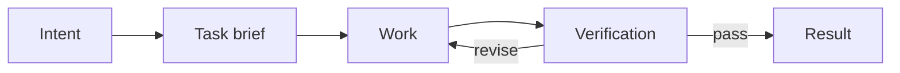

# Level 1 — Focused Session

Use one AI session to complete one clear, inspectable task.

## Use when

- the task fits comfortably in one session;
- the desired output is already understood;
- mistakes are cheap and reversible;
- a person can inspect the result directly;
- persistent specialist roles would add more overhead than value.

## Do not use when

- another session must resume the work without you;
- unresolved decisions can affect later work;
- the result is difficult to verify by inspection;
- the same context should not both produce and approve the result;
- the task includes high-impact or irreversible actions.

## Lifecycle

## Responsibilities

The human owns intent, scope, and final acceptance. One AI session may clarify, perform, and self-check the work. There is no claim of independent review.

## Required artifact

Copy [Task brief](../templates/task-brief.md). For very small tasks, the filled brief may live directly in the initial prompt.

## Completion contract

The session must report:

1. what changed or was produced;
2. how it was checked;
3. any uncertainty or unverified assumption;
4. any follow-up that remains outside scope.

## Model and effort

Use the least expensive configuration that can follow the brief and perform the required verification. Increase reasoning effort for ambiguity, not merely because the project is important.

## Upgrade to Level 2 when

- work frequently resumes in a new chat;
- decisions or progress are reconstructed from memory;
- the task grows into a queue;
- the result becomes input to later sessions.

