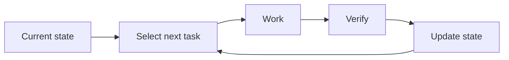

# Level 2 — Resumable Project

Use a small set of canonical files so one role can continue work across sessions, pauses, or model changes.

## Use when

- the work spans multiple sessions;
- the same person still drives planning and acceptance;
- a queue or durable project state is required;
- context loss is a larger risk than review bias;
- the workflow does not need autonomous repetition.

## Do not use when

- the work fits safely in one session;
- the planner’s context should not influence implementation or review;
- specialist reports are required before a decision;
- an orchestrator should advance several tasks without manual routing.

## Lifecycle

## Required artifacts

- [Project instructions](../templates/project-instructions.md)
- [Current state](../templates/current-state.md)
- [Task brief](../templates/task-brief.md)
- a small work queue inside `CURRENT_STATE.md` or a separate tracker;
- [Decision record](../templates/decision-record.md) when a choice will affect future work.

## Session start

1. Read the project instructions.
2. Read `CURRENT_STATE.md`.
3. Load only the references named for the current task.
4. Confirm the intended outcome and any unresolved decision.
5. Work on one selected task.

Where the tool supports it, steps 1 and 2 should be injected automatically at session start rather than requested politely. See [Injected entry point](../components/memory-and-context.md#injected-entry-point).

## Session end

1. Verify the result.
2. Record what changed.
3. Update the current position and next task.
4. Record durable decisions in their canonical home.
5. Remove or archive state that is no longer current.

## Memory rule

Do not solve continuity by asking every session to read every file. `CURRENT_STATE.md` routes the session to the smallest complete context.

## Optional domain knowledge

A session may consult an existing knowledge base. If domain research becomes recurring and begins producing project-specific verdicts, add the [Domain role pipeline](../pipelines/domain-role.md) and consider Level 3.

## Upgrade to Level 3 when

- the same session repeatedly validates its own assumptions;
- task descriptions contain unresolved product or architecture choices;
- implementation needs a clean context;
- review needs a distinct perspective;
- specialist knowledge must produce durable reports.

