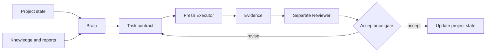

# Level 3 — Separated Lifecycle

Separate decisions, execution, and review into distinct contexts connected by durable artifacts.

## Use when

- the work is complex enough to require explicit decisions;
- a fresh Executor can reduce context bias;
- completion requires more than human spot-checking;
- domain roles must produce reports;
- the result should be reviewed against a stable task contract.

## Do not use when

- coordination costs more than the task;
- there is no meaningful distinction between the roles;
- the output cannot be evaluated against explicit criteria;
- the workflow must autonomously repeat across a task queue.

## Lifecycle

## Roles

### Human owner

Owns intent, high-impact boundaries, and explicit approvals.

### Brain

Selects the next task, resolves required decisions, consults domain reports, and writes a self-contained contract.

### Executor

Starts with a fresh, bounded context. Implements the task without reopening resolved decisions. Stops when required information is missing or contradictory.

Fresh context is the default for a new task, not a rule for every dispatch: a bounded repair to the task just completed is cheaper with the same Executor resumed. See [Fresh context is the default, not a universal rule](../components/model-and-context-routing.md#fresh-context-is-the-default-not-a-universal-rule).

### Reviewer

Examines the actual result and its evidence against the task contract. By default, reports findings rather than changing the result.

### Domain role

Researches a recurring domain, maintains reusable knowledge, and produces dated reports for specific questions. It recommends or decides only within its authority boundary.

## Required artifacts

- [Project instructions](../templates/project-instructions.md)
- [Current state](../templates/current-state.md)
- [Task contract](../templates/task-spec.md)
- [Decision record](../templates/decision-record.md)
- [Evidence bundle](../templates/evidence-bundle.md)
- [Review finding](../templates/review-finding.md)
- [Review inbox](../templates/review-inbox.md)
- [Approval log](../templates/approval-log.md) for human-only gates
- role knowledge bases and reports when domain specialization is used

## Ready-to-execute rule

A task is ready only when it contains:

- a concrete outcome;
- resolved decisions;
- in-scope and out-of-scope boundaries;
- references with clear authority;
- required evidence;
- stop conditions;
- a completion report format.

The Executor should not need to rediscover the product decision that created the task.

## Review rule

A separate review context reduces author bias but is not sufficient evidence by itself. Review the exact output state, inspect primary artifacts, and run deterministic checks where possible.

Reviewers write findings into a shared inbox; they do not silently modify the result. The decision layer triages every finding as fixed, accepted, deferred, or invalid. See [Review and triage](../components/review-and-triage.md).

## Completion

The result is integrated only after:

1. required evidence exists;
2. deterministic checks pass or their limits are recorded;
3. review findings are resolved, accepted, or explicitly deferred;
4. required human approval is recorded;
5. project state is updated after integration, not merely after implementation.

Integration has a shape of its own: a separate work line, one atomic unit per task, and a closing invariant that leaves nothing half-landed. See [Integration and landing](../components/integration-and-landing.md).

## Upgrade to Level 4 when

- a person mainly transports task contracts and reports between roles;
- the same lifecycle repeats across a queue;
- cross-domain questions need automatic routing;
- task and run stop conditions can be defined;
- evidence is strong enough to gate autonomous transitions.
