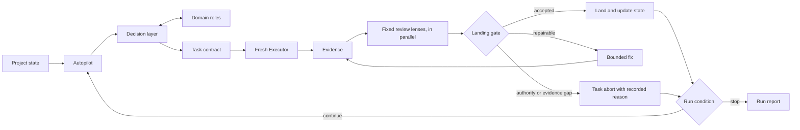

# Level 4 — Governed Autonomy

Allow an orchestrator to repeat the separated lifecycle across bounded tasks without giving it unlimited decision authority.

## Use when

- Level 3 already works reliably by hand;
- a queue contains several bounded tasks;
- task readiness and completion are inspectable;
- domain questions can be routed to roles with explicit contracts;
- autonomous progress is worth the additional cost and failure surface.

## Do not use when

- the intended outcome is still being discovered;
- evidence cannot distinguish completion from plausible prose;
- human-only decisions are not explicitly named;
- the system has no run budget, stop conditions, or recovery path;
- the underlying Level 3 loop is unreliable.

## Lifecycle

## Autopilot responsibility

The Autopilot may:

- select the next eligible task;
- request reports from declared roles;
- route measurable disagreements to the declared decision authority;
- create a task contract through the Brain role;
- dispatch a fresh Executor;
- request evidence and separately scoped review;
- apply bounded repair policy;
- advance only after the landing gate;
- stop and report when a boundary is reached.

The Autopilot may not automatically:

- reinterpret project intent;
- manufacture missing approval;
- broaden its own authority;
- change workflow policy because a task is inconvenient;
- hide residual findings;
- treat repeated agent summaries as independent evidence;
- continue indefinitely without a run budget.

## Required additions to Level 3

- an explicit run objective;
- eligible-task rules;
- task and run stop conditions;
- a task budget or time budget;
- escalation routing;
- landing verification and a named revert unit;
- a recovery and abort policy;
- a final run report;
- versioned workflow rules.

Use the canonical [Authority and approvals](../components/authority-and-approvals.md), [Evidence and verification](../components/evidence-and-verification.md), and [Integration and landing](../components/integration-and-landing.md) components.

Autonomous landing is the largest permission on this list, and it rests entirely on being cheap to undo. Name the revert unit before enabling the run, and keep it small enough that removing one bad result does not require removing a day of good ones.

Start the run from [Run contract](../templates/run-contract.md) and close it with [Run report](../templates/run-report.md). The run contract may bound work by eligible tasks, elapsed time, cost, or a fixed task count, but the chosen limit must be explicit before execution begins.

## Eligible work and queue premise

A queue entry is a claim about the project, and the run itself keeps invalidating it: work that lands during the run repairs part of what the remaining entries describe, and an entry written days ago describes a project that no longer exists.

Before authoring a contract, verify the entry’s premise against current state rather than against the wording of the entry. If the premise is already satisfied — including by earlier tasks in this same run — the correct outcome is a task abort with a recorded reason and a queue update, not a contract that repairs a defect nobody has anymore.

Expect this routinely on any queue that accumulates faster than it drains. A run that never finds a dead premise is more likely to be failing to check than to be working from a fresh queue.

## Never stall the run

In most harnesses, asking a question ends the turn. There is no primitive for “ask and continue,” so a question addressed to the human is a run stop wearing the costume of a pause: nothing resumes until a person returns to the session.

Therefore an authority gap is a task-level event, not a run-level one. Record what would have to be decided and by whom, skip the entry, and take the next eligible task. The human handoff belongs at the end of the run, where one person reads one report containing every skipped decision at once.

An orchestrator must also not end a turn to report progress. A progress report is not a boundary, and a run that pauses to be admired has stopped.

## Two different stop conditions

### Task stop

Stops one task when it lacks evidence, exceeds repair limits, crosses authority, or contradicts current project state. The run may continue with another eligible task.

### Run stop

Stops the entire run when its budget is exhausted, project state is unsafe to advance, repeated failures indicate a systemic problem, or a required human decision blocks the remaining queue.

## Review lenses

Prefer a fixed set of lenses, dispatched on every task, over a set chosen per task. Distinctness should come from how each lens is defined — its question, its evidence surface, its expertise — not from an orchestrator deciding, task by task, which risks are worth looking for. An orchestrator that selects its own reviewers can also select the one that will not object, and it makes that choice while holding the same assumptions the review exists to catch.

Run the lenses concurrently. Sequential review adds elapsed time without adding independence, and elapsed time is what gets a review skipped under budget pressure.

This does not license more reviewers. Dispatching several generic reviewers and treating their agreement as independent proof is still a false signal: add a lens only when it inspects something no current lens can see, and retire one when two lenses keep reporting the same finding.

## Completion

A run ends with:

- integrated tasks and their evidence;
- blocked or aborted tasks with reasons;
- unresolved findings;
- changes to project state;
- measured workflow observations;
- the exact boundary that ended the run.

The workflow may collect measurements during a run, but it must not rewrite its own operating policy mid-run. Route proposed process changes through [Workflow evolution](../components/workflow-evolution.md).

## Downgrade when

If Autopilot primarily waits for human routing, fails the same gate repeatedly, or cannot produce trustworthy evidence, return to Level 3 until the underlying lifecycle is repaired.
