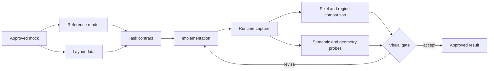

# Mock-to-implementation pipeline

Turn an approved visual mock into an inspectable implementation target, then compare the implemented output against that target.

## Lifecycle



## 1. Approve the mock

The mock defines the intended composition and hierarchy. Record the approved frame, state, dimensions, and any intentionally open details.

Do not begin precision comparison against an unapproved moving target.

## 2. Produce a deterministic reference render

Render the approved mock at a fixed viewport, scale factor, fonts, and asset set. A reference that changes across runs cannot act as an etalon.

Fail closed if required fonts or source assets are unavailable.

A concrete file-based implementation may use this shape:

```text
approved-mock.html
    ├── reference.png
    ├── layout.json
    └── probes.json

implementation-revision
    ├── runtime-capture.png
    ├── visual-diff.png
    └── verification-report.md
```

HTML, JSON, and PNG are examples rather than mandatory technologies. The invariant is that the reference, measurable layout, implemented capture, and comparison result are inspectable and tied to exact states.

## 3. Extract layout data

Where possible, produce machine-readable information for each meaningful element:

- stable element ID;
- position and dimensions;
- typography;
- colors, borders, radius, and shadows;
- padding and layout relationships;
- displayed text;
- referenced assets.

This data carries measurable shape into the task contract instead of asking the Executor to infer geometry from prose.

## 4. Write the implementation contract

The contract combines:

- behavioral requirements;
- approved reference frame;
- layout data;
- required states;
- comparison regions;
- semantic assertions;
- known differences between rendering environments;
- completion evidence.

## 5. Capture the implementation

Produce a runtime capture at the same intended viewport and state. Record the implementation revision and capture conditions.

## 6. Compare

Use more than one signal.

### Pixel or image comparison

Useful for missing assets, offsets, spacing, unexpected color changes, and large visual regressions.

### Region comparison

Allows different tolerances for text, raster assets, flat geometry, or animated regions.

### Geometry probes

Check element positions, dimensions, containment, overlap, safe areas, and alignment.

### Semantic assertions

Check that the correct state, text, action, data, and hierarchy are present. A visually similar output can still represent the wrong state.

### Human visual judgment

Confirms composition, readability, and whether accepted technical differences still preserve the intended result.

## Pixel-perfect is not semantic correctness

Different rendering engines may rasterize text and effects differently. A raw full-frame threshold can become impossible to pass or can hide important regional errors.

Therefore:

- calibrate tolerances against known renderer differences;
- compare text separately from flat geometry;
- test the verifier against a known defect;
- keep semantic assertions independent of pixel similarity;
- report excluded regions honestly;
- require human review for subjective composition.

## Calibrate the verifier before trusting it

Run the comparison against known defects, not only against an expected pass. Useful calibration fixtures include:

- a meaningful element shifted beyond tolerance;
- a missing or substituted asset;
- wrong visible text or state;
- a required font failing to load;
- an interaction target outside its expected geometry;
- one deliberately excluded animated or nondeterministic region.

Record which defects each signal detects. A full-frame pixel metric, a geometry probe, and a semantic assertion protect different claims; none should borrow confidence from the others.

Tie the reference, implementation, captures, and report to exact versions or content hashes. Otherwise a passing report can outlive the artifacts it evaluated.

## Regeneration rule

Generated renders, layout dumps, and probes may remain ephemeral if a tracked, reproducible entry point can rebuild them. Durable process means preserving the recipe and inputs, not necessarily committing every generated file.

## Completion evidence

Use [Visual verification report](../templates/visual-verification-report.md) to record the reference, implementation revision, captures, comparison results, semantic checks, exclusions, and approval.
