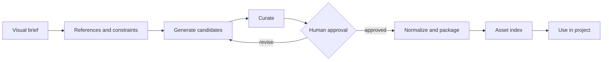

# Visual asset pipeline

Treat generated visual material as a governed project artifact rather than a disposable model output.

## Lifecycle



## 1. Visual brief

Define:

- purpose in the project;
- required subject or information;
- composition and format;
- dimensions and technical constraints;
- required variants;
- forbidden content;
- reference sources;
- acceptance owner.

Use [Visual brief](../templates/visual-brief.md).

## 2. References and source policy

Record which references may guide composition, style, or factual content. Separate inspiration from assets that may be reused directly. Preserve provenance and license constraints.

## 3. Candidate generation

Generate a bounded set of candidates from the same brief. Record the prompt or generation inputs when reproduction matters. Generation does not imply approval.

Treat a batch as an addressable artifact. Record the brief version, generation configuration, candidate IDs, and output paths so later review refers to exact images rather than “the last result in chat.”

## 4. Curation

Evaluate candidates against the brief, not against whichever output is most visually impressive. Reject candidates with factual, compositional, consistency, or source-policy defects.

## 5. Human approval

Subjective composition and final visual identity require an explicit acceptance record when assigned as human-only decisions.

## 6. Normalization

Apply reproducible transformations after approval:

- crop and framing;
- dimensions and scale;
- color profile;
- background or alpha treatment;
- file format and compression;
- naming;
- variant packaging.

Do not silently redraw or regenerate after approval. A material visual change returns to the approval step.

Normalization should be reproducible. Preserve either the transformation recipe or an exact manifest of crop, scale, color, alpha, compression, and variant operations.

## 7. Asset index

Track:

- stable asset ID;
- status: candidate, approved, rejected, retired;
- source or generation provenance;
- approved file path;
- allowed use;
- dimensions and variants;
- approval record;
- replacement history.

The index prevents rejected or stale candidates from reappearing as valid project assets.

Use [Asset index](../templates/asset-index.md) as a starting shape.

## Minimal file-backed form

```text
visuals/
├── briefs/             approved intent and constraints
├── recipes/            prompts, inputs, and reproducible transformations
├── candidates/         generated batches, never implicitly approved
├── approved/           only assets tied to an approval record
├── rejected/           clearly excluded candidates when retained
└── INDEX.md             status, provenance, use, and replacement history
```

The names are optional. The separation between intent, candidates, approved outputs, and status is not.

## Failure controls

- **Prompt drift:** bind every batch to a specific brief version.
- **Ambiguous selection:** approval names the exact candidate or content hash.
- **Post-approval mutation:** material edits create a new candidate or version.
- **Stale reuse:** the index distinguishes approved, rejected, retired, and replaced assets.
- **Unknown provenance:** the brief records source and license constraints before generation.
- **Irreproducible packaging:** normalization records inputs and transformations.

## Evidence

The pipeline completes with the exact approved candidate, normalized outputs, an updated asset index, the explicit approval record, and a record of the transformations applied.
